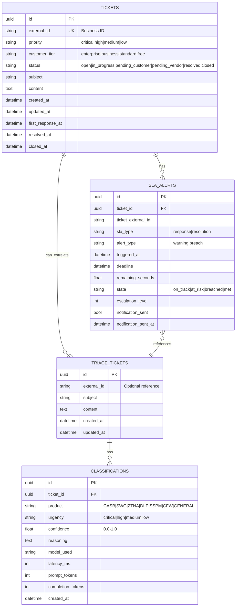
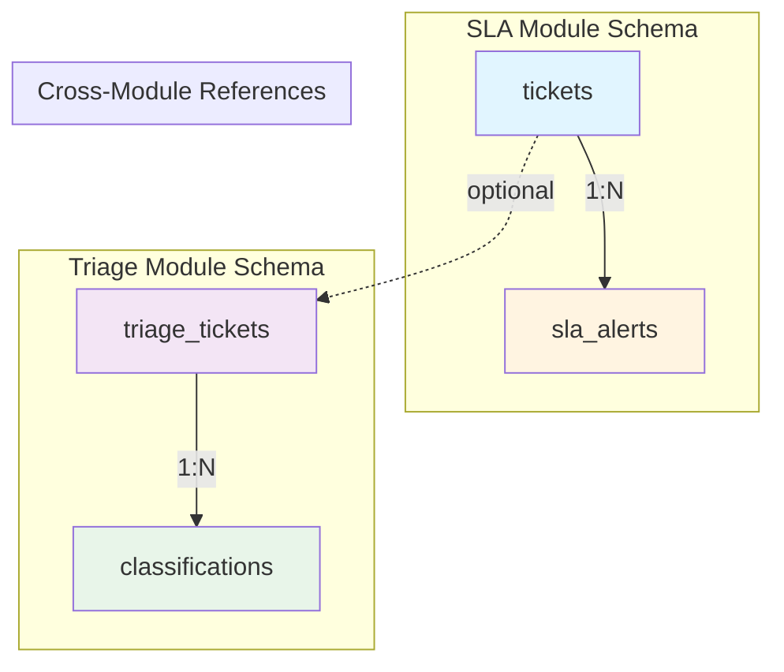
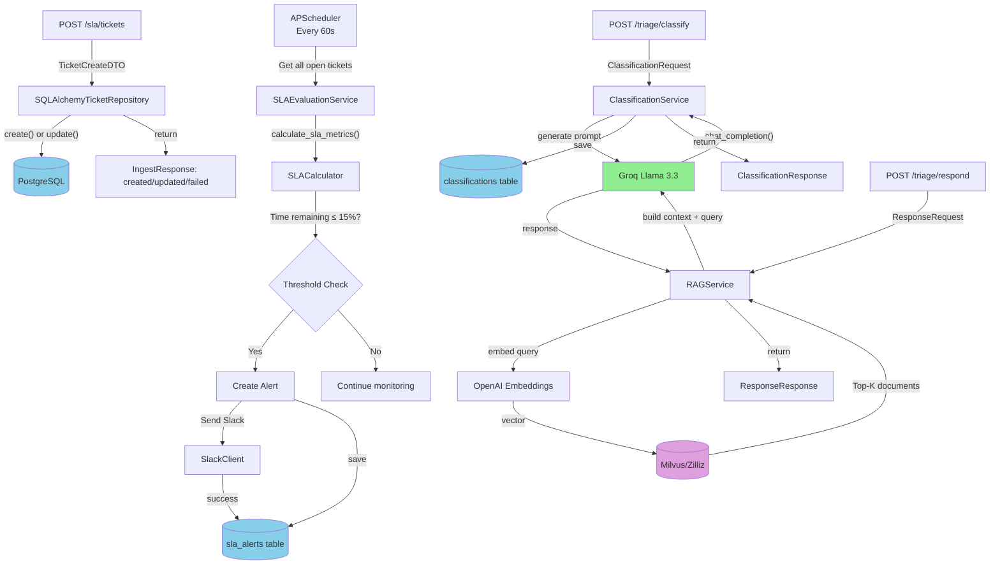
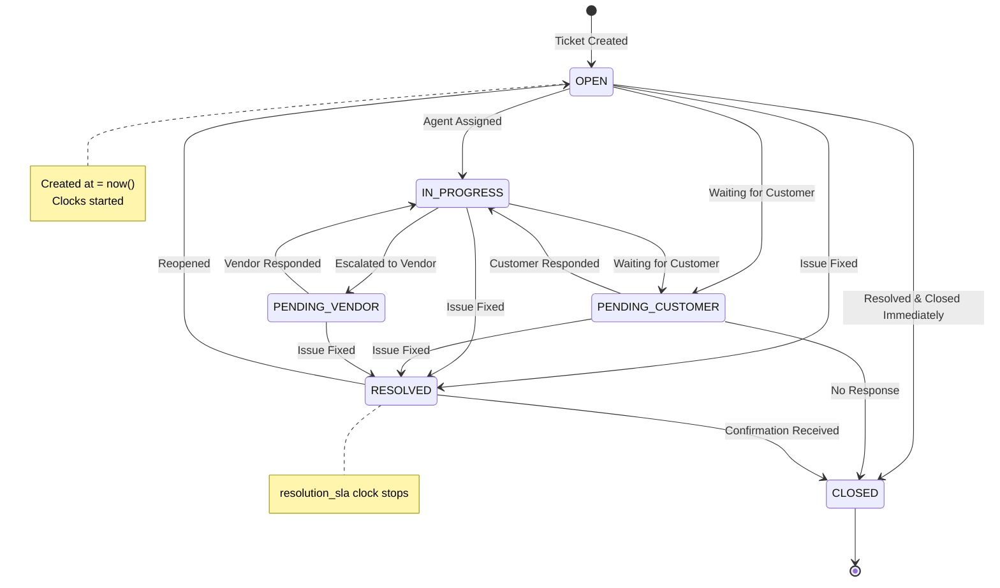
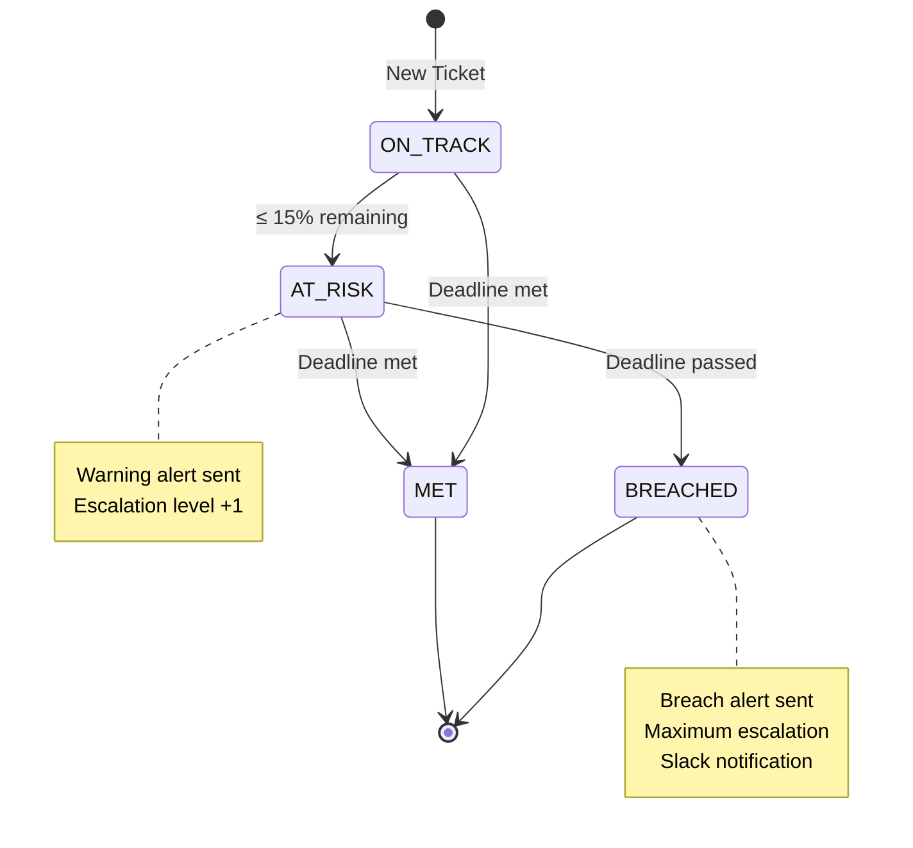
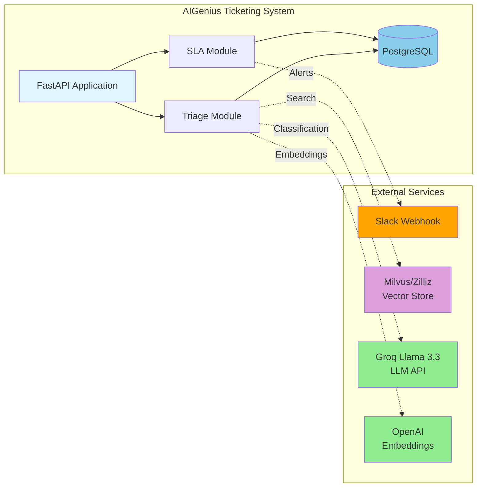
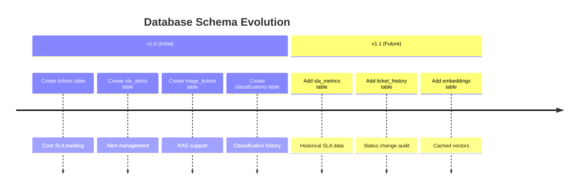

# Data Model Documentation

**AIGenius Ticketing System - Database Schema & Entity Relationships**

---

## ER Diagram (Entity-Relationship)



---

## Database Schema Diagram



---

## Table Definitions

### SLA Module

#### `tickets` Table
| Column | Type | Constraints | Description |
|--------|------|-------------|-------------|
| `id` | UUID | PK, DEFAULT uuid4() | Internal primary key |
| `external_id` | VARCHAR(255) | UNIQUE, NOT NULL, INDEX | External ticket ID (e.g., TICKET-100) |
| `priority` | VARCHAR(50) | NOT NULL, DEFAULT 'medium' | Priority level |
| `customer_tier` | VARCHAR(50) | NOT NULL, DEFAULT 'standard' | Customer tier |
| `status` | VARCHAR(50) | NOT NULL, DEFAULT 'open' | Ticket status |
| `subject` | VARCHAR(500) | NOT NULL | Ticket subject |
| `content` | TEXT | NOT NULL | Ticket description |
| `created_at` | TIMESTAMPTZ | NOT NULL, DEFAULT NOW() | Creation timestamp |
| `updated_at` | TIMESTAMPTZ | NOT NULL, DEFAULT NOW() | Last update timestamp |
| `first_response_at` | TIMESTAMPTZ | NULLABLE | First response time |
| `resolved_at` | TIMESTAMPTZ | NULLABLE | Resolution time |
| `closed_at` | TIMESTAMPTZ | NULLABLE | Closure time |

**Indexes:**
- `external_id` (unique)
- Composite for status filtering

**Enums:**
- `priority`: `critical`, `high`, `medium`, `low`
- `customer_tier`: `enterprise`, `business`, `standard`, `free`
- `status`: `open`, `in_progress`, `pending_customer`, `pending_vendor`, `resolved`, `closed`

---

#### `sla_alerts` Table
| Column | Type | Constraints | Description |
|--------|------|-------------|-------------|
| `id` | UUID | PK, DEFAULT uuid4() | Primary key |
| `ticket_id` | UUID | NOT NULL, INDEX (→ tickets.id) | Foreign key to tickets |
| `ticket_external_id` | VARCHAR(255) | NOT NULL | Denormalized external ID |
| `sla_type` | VARCHAR(50) | NOT NULL | SLA clock type |
| `alert_type` | VARCHAR(50) | NOT NULL | Alert severity |
| `triggered_at` | TIMESTAMPTZ | NOT NULL, DEFAULT NOW() | Alert trigger time |
| `deadline` | TIMESTAMPTZ | NOT NULL | SLA deadline |
| `remaining_seconds` | FLOAT | NOT NULL | Time remaining (negative if breached) |
| `state` | VARCHAR(50) | NOT NULL | Current SLA state |
| `escalation_level` | INTEGER | NOT NULL, DEFAULT 1 | Escalation level |
| `notification_sent` | BOOLEAN | NOT NULL, DEFAULT FALSE | Slack notification status |
| `notification_sent_at` | TIMESTAMPTZ | NULLABLE | Notification timestamp |

**Enums:**
- `sla_type`: `response`, `resolution`
- `alert_type`: `warning`, `breach`
- `state`: `on_track`, `at_risk`, `breached`, `met`

---

### Triage Module

#### `triage_tickets` Table
| Column | Type | Constraints | Description |
|--------|------|-------------|-------------|
| `id` | UUID | PK, DEFAULT uuid4() | Primary key |
| `external_id` | VARCHAR(255) | NULLABLE, INDEX | Optional external reference |
| `subject` | VARCHAR(500) | NOT NULL | Ticket subject |
| `content` | TEXT | NOT NULL | Ticket content |
| `created_at` | TIMESTAMPTZ | NOT NULL, DEFAULT NOW() | Creation timestamp |
| `updated_at` | TIMESTAMPTZ | NULLABLE | Last update timestamp |

**Note:** This is a separate table from `tickets` to support RAG operations. Can be correlated via `external_id`.

---

#### `classifications` Table
| Column | Type | Constraints | Description |
|--------|------|-------------|-------------|
| `id` | UUID | PK, DEFAULT uuid4() | Primary key |
| `ticket_id` | UUID | NOT NULL, INDEX, FK (→ triage_tickets.id ON DELETE CASCADE) | Foreign key |
| `product` | VARCHAR(50) | NOT NULL | Product category |
| `urgency` | VARCHAR(50) | NOT NULL | Urgency level |
| `confidence` | FLOAT | NOT NULL | Classification confidence (0.0-1.0) |
| `reasoning` | TEXT | NOT NULL | AI explanation |
| `model_used` | VARCHAR(100) | NOT NULL | LLM model identifier |
| `latency_ms` | INTEGER | NOT NULL | Processing time in milliseconds |
| `prompt_tokens` | INTEGER | NOT NULL, DEFAULT 0 | Input tokens used |
| `completion_tokens` | INTEGER | NOT NULL, DEFAULT 0 | Output tokens generated |
| `created_at` | TIMESTAMPTZ | NOT NULL, DEFAULT NOW() | Classification timestamp |

**Enums:**
- `product`: `CASB`, `SWG`, `ZTNA`, `DLP`, `SSPM`, `CFW`, `GENERAL`
- `urgency`: `critical`, `high`, `medium`, `low`

**Relationship:** One ticket can have multiple classification records (history).

---

## Data Flow Diagram



---

## State Transitions

### Ticket Status Lifecycle



### SLA Alert State Machine



---

## Clean Architecture Mapping

```
┌─────────────────────────────────────────────────────────────┐
│                     DOMAIN LAYER                              │
│  (Pure Python - No framework dependencies)                    │
├─────────────────────────────────────────────────────────────┤
│  src/sla/domain/                                            │
│  ├── entities.py          Ticket, SLAMetrics, SLAAlert      │
│  └── value_objects.py    SLAConfig, Priority, CustomerTier  │
│                                                             │
│  src/triage/domain/                                          │
│  └── entities.py          TriageTicket, ClassificationResult │
└─────────────────────────────────────────────────────────────┘
                              ↓
┌─────────────────────────────────────────────────────────────┐
│                   APPLICATION LAYER                           │
│  (Business logic - orchestrates domain + infrastructure)       │
├─────────────────────────────────────────────────────────────┤
│  src/sla/application/                                       │
│  ├── dto.py              TicketEntityDTO, IngestResponse      │
│  └── services.py         SLAService, SLAEvaluationService    │
│                                                             │
│  src/triage/application/                                    │
│  ├── dto.py              ClassificationRequest, ResponseDTO   │
│  └── services.py         ClassificationService, RAGService    │
└─────────────────────────────────────────────────────────────┘
                              ↓
┌─────────────────────────────────────────────────────────────┐
│                INFRASTRUCTURE LAYER                           │
│  (Database, External APIs - concrete implementations)           │
├─────────────────────────────────────────────────────────────┤
│  src/sla/infrastructure/                                   │
│  └── models.py          TicketModel, AlertModel (SQLAlchemy)│
│                                                             │
│  src/triage/infrastructure/                                │
│  └── models.py          TriageTicketModel, ClassificationModel│
└─────────────────────────────────────────────────────────────┘
                              ↓
                      ┌─────────────┐
                      │  PostgreSQL  │
                      │   Database   │
                      └─────────────┘
```

---

## External Systems Integration



---

## Enum Values Reference

### Priority Levels (SLA)
| Value | Response Target | Resolution Target | Description |
|-------|-----------------|-------------------|-------------|
| `critical` | 15 min | 2 hours | Production down |
| `high` | 30 min | 4 hours | Major feature broken |
| `medium` | 2 hours | 8 hours | Single feature affected |
| `low` | 4 hours | 24 hours | Minor issues |

### Customer Tier Multipliers
| Tier | Multiplier | Description |
|------|------------|-------------|
| `enterprise` | 0.5x | Faster SLAs |
| `business` | 0.75x | Priority SLAs |
| `standard` | 1.0x | Standard SLAs |
| `free` | 1.5x | Extended SLAs |

### Product Categories (Triage)
| Product | Description |
|---------|-------------|
| `CASB` | Cloud Access Security Broker |
| `SWG` | Secure Web Gateway |
| `ZTNA` | Zero Trust Network Access |
| `DLP` | Data Loss Prevention |
| `SSPM` | SaaS Security Posture Management |
| `CFW` | Cloud Firewall |
| `GENERAL` | Unclassified / Other |

### SLA States
| State | Condition | Action |
|-------|-----------|--------|
| `on_track` | > 15% remaining | Monitor |
| `at_risk` | ≤ 15% remaining | Send warning |
| `breached` | Deadline passed | Escalate |
| `met` | SLA achieved | Clock stopped |

---

## Index Strategy

### Performance Indexes
```sql
-- tickets table
CREATE INDEX idx_tickets_external_id ON tickets(external_id);
CREATE INDEX idx_tickets_status ON tickets(status);
CREATE INDEX idx_tickets_priority ON tickets(priority);
CREATE INDEX idx_tickets_customer_tier ON tickets(customer_tier);
CREATE INDEX idx_tickets_created_at ON tickets(created_at);

-- sla_alerts table
CREATE INDEX idx_sla_alerts_ticket_id ON sla_alerts(ticket_id);
CREATE INDEX idx_sla_alerts_state ON sla_alerts(state);
CREATE INDEX idx_sla_alerts_triggered_at ON sla_alerts(triggered_at);

-- triage_tickets table
CREATE INDEX idx_triage_tickets_external_id ON triage_tickets(external_id);
CREATE INDEX idx_triage_tickets_created_at ON triage_tickets(created_at);

-- classifications table
CREATE INDEX idx_classifications_ticket_id ON classifications(ticket_id);
CREATE INDEX idx_classifications_product ON classifications(product);
CREATE INDEX idx_classifications_urgency ON classifications(urgency);
CREATE INDEX idx_classifications_created_at ON classifications(created_at);
```

---

## Migration Strategy

### Schema Evolution



### Rollback Plan
- All migrations use reversible SQLAlchemy operations
- Foreign keys have `ON DELETE CASCADE` for cleanup
- Indexes can be dropped without data loss
- Timestamps use `timezone=True` for UTC consistency

---

## Data Volume Estimates

| Table | Rows (Year 1) | Rows (Year 3) | Storage |
|-------|---------------|---------------|---------|
| `tickets` | 50,000 | 200,000 | ~100 MB |
| `sla_alerts` | 150,000 | 600,000 | ~150 MB |
| `triage_tickets` | 50,000 | 200,000 | ~50 MB |
| `classifications` | 100,000 | 500,000 | ~200 MB |

**Total (Year 1):** ~500 MB
**Total (Year 3):** ~1.2 GB

---

## Related Files

- **SLA Models**: [`src/sla/infrastructure/models.py`](../src/sla/infrastructure/models.py)
- **Triage Models**: [`src/triage/infrastructure/models.py`](../src/triage/infrastructure/models.py)
- **Configuration**: [`src/config/__init__.py`](../src/config/__init__.py)
- **Database**: [`src/infrastructure/database/__init__.py`](../src/infrastructure/database/__init__.py)

---

**Document Version**: 1.0
**Last Updated**: 2025-12-25
**Author**: Kuldeep Pal
